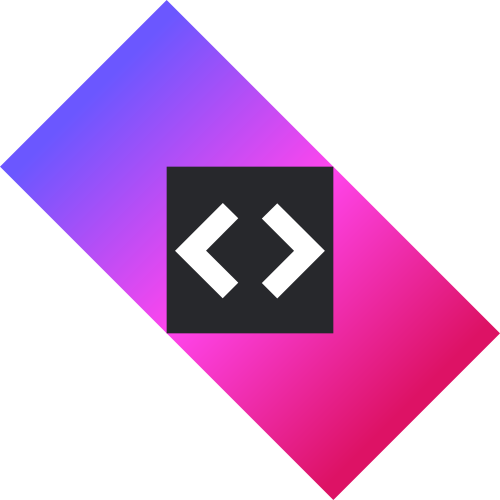
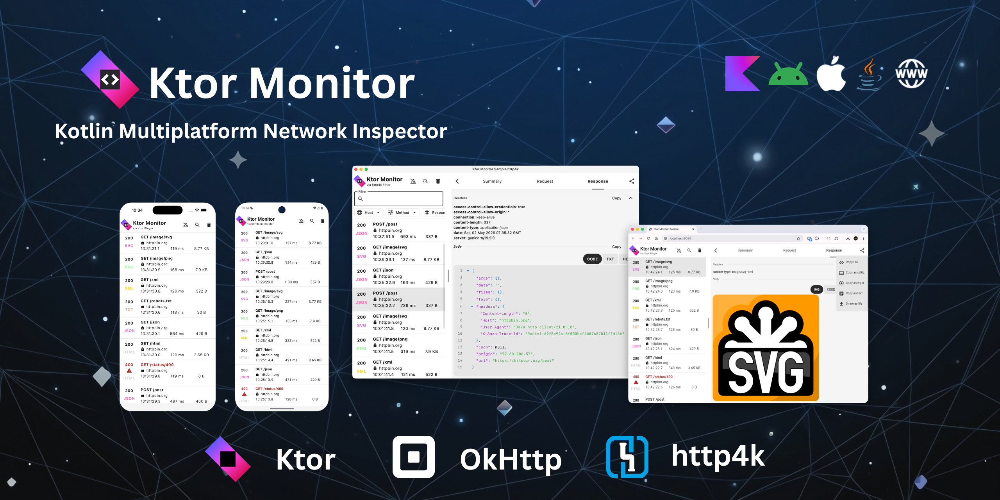

[](https://search.maven.org/artifact/ro.cosminmihu.ktor/ktor-monitor-logging)
[](https://github.com/CosminMihuMDC/KtorMonitor/blob/main/LICENSE)
[](https://cosminmihumdc.github.io/KtorMonitor)
[](https://kotlinlang.slack.com/archives/C0AB9GA32H0)
[](https://klibs.io/project/CosminMihuMDC/KtorMonitor)
[](https://cosminmihumdc.github.io/KtorMonitor)
[](https://cosminmihumdc.github.io/KtorMonitor/api)
[](https://github.com/CosminMihuMDC/KtorMonitor)
[](https://github.com/CosminMihuMDC/KtorMonitor/fork)

#  KtorMonitor
Powerful tool to monitor [Ktor Client](https://ktor.io/), [OkHttp](https://square.github.io/okhttp/) and [http4k](https://www.http4k.org/) requests and responses, making it easier to debug and analyze network communication.



## ✨ Features

*   🌐**Ktor Network Monitoring**: Real-time interception and logging of [Ktor Client](https://ktor.io/) traffic.
*   🌐**OkHttp Network Monitoring**: Real-time interception and logging of [OkHttp](https://square.github.io/okhttp/) traffic.
*   🌐**http4k Network Monitoring**: Real-time interception and logging of [http4k](https://www.http4k.org/) traffic.
*   📱**Kotlin Multiplatform (KMP)**: Full support for **Android**, **iOS**, **Desktop (JVM)**, **Wasm**, and **JS**.
*   🛠️**Highly Configurable**: Customize retention periods, content length limits, and notification behavior.
*   🔒**Security First**: Redact sensitive headers (e.g., *Authorization*).
*   📂**Data Export**: Save request/response details to local files for easier debugging or sharing.
*   🎨**Rich Previews**: Built-in viewers for *JSON*, *XML*, *HTML*, *CSS*, *Form Data*, *Image* (*JPG*, *PNG*, *SVG*, *GIF*, *WEBP*).
*   📡**SSE & WebSockets**: Track one-way streams (*SSE*) and bidirectional traffic (*WebSockets*).
*   🛡️**Production Safe**: No-Op version to ensure monitoring code is excluded from your production builds.

## 📦 Setup (Kotlin Multiplatform) for [Ktor Client](https://ktor.io/)

### 

```kotlin
kotlin {
    sourceSets {
        commonMain.dependencies {
            implementation("ro.cosminmihu.ktor:ktor-monitor-logging:1.13.0")
        }
    }
}
```

**For Release Builds (No-Op)**

To isolate KtorMonitor from release builds, use the `ktor-monitor-logging-no-op` variant. This ensures the monitor code is not included in production artifact.

```kotlin
kotlin {
    sourceSets {
        commonMain.dependencies {
            implementation("ro.cosminmihu.ktor:ktor-monitor-logging-no-op:1.13.0")
        }
    }
}
```

## 📦 Setup (Android only) for [Ktor Client](https://ktor.io/)

### 

```kotlin
dependencies {
    debugImplementation("ro.cosminmihu.ktor:ktor-monitor-logging:1.13.0")
    releaseImplementation("ro.cosminmihu.ktor:ktor-monitor-logging-no-op:1.13.0")
}
```

For ***Android minSdk < 26***, [Core Library Desugaring](https://developer.android.com/studio/write/java8-support#library-desugaring) is required.

###  Install Ktor Client Plugin

```kotlin
HttpClient {
	
    install(KtorMonitorLogging) {  
        sanitizeHeader { header -> header == "Authorization" }  
        filter { request -> !request.url.host.contains("cosminmihu.ro") }  
        showNotification = true  
        retentionPeriod = RetentionPeriod.OneHour
        maxContentLength = ContentLength.Default
    }
}
```

- ```sanitizeHeader``` - sanitize sensitive headers to avoid their values appearing in the logs
- ```filter``` - filter logs for calls matching a predicate.
- ```showNotification``` - Keep track of latest requests and responses into notification. Default is **true**. Android and iOS only. Notifications permission needs to be granted.
- ```retentionPeriod``` - The retention period for the logs. Default is **1h**.
- ```maxContentLength``` - The maximum length of the content that will be logged. After this, body will be truncated. Default is **250_000**. To log the entire body use ```ContentLength.Full```.

## 📦 Setup (Android & JVM only) for [OkHttp](https://square.github.io/okhttp/)

### 

```kotlin
dependencies {
    debugImplementation("`ro.cosminmihu.ktor:ktor-monitor-okhttp-interceptor:1.13.0")
    releaseImplementation("ro.cosminmihu.ktor:ktor-monitor-okhttp-interceptor-no-op:1.13.0")
}
```

For ***Android minSdk < 26***, [Core Library Desugaring](https://developer.android.com/studio/write/java8-support#library-desugaring) is required.

###  Install OkHttp Interceptor

```kotlin
OkHttpClient.Builder()
    .addNetworkInterceptor(
        KtorMonitorInterceptor {
            sanitizeHeader { header -> header == "Authorization" }
            filter { request -> !request.url.host.contains("cosminmihu.ro") }
            showNotification = true
            retentionPeriod = RetentionPeriod.OneHour
            maxContentLength = ContentLength.Default
        }
    )
    .build()
```

- ```sanitizeHeader``` - sanitize sensitive headers to avoid their values appearing in the logs
- ```filter``` - filter logs for calls matching a predicate.
- ```showNotification``` - Keep track of latest requests and responses into notification. Default is **true**. Android and iOS only. Notifications permission needs to be granted.
- ```retentionPeriod``` - The retention period for the logs. Default is **1h**.
- ```maxContentLength``` - The maximum length of the content that will be logged. After this, body will be truncated. Default is **250_000**. To log the entire body use ```ContentLength.Full```.

## 📦 Setup (Android & JVM only) for [http4k](https://www.http4k.org/)

### 

```kotlin
dependencies {
    debugImplementation("ro.cosminmihu.ktor:ktor-monitor-http4k-filter:1.13.0")
    releaseImplementation("ro.cosminmihu.ktor:ktor-monitor-http4k-filter-no-op:1.13.0")
}
```

For ***Android minSdk < 26***, [Core Library Desugaring](https://developer.android.com/studio/write/java8-support#library-desugaring) is required.

###  Install http4k Filter

```kotlin
KtorMonitorFilter {
    sanitizeHeader { header -> header == "Authorization" }
    filter { request -> !request.uri.host.contains("cosminmihu.ro") }
    showNotification = true
    retentionPeriod = RetentionPeriod.OneHour
    maxContentLength = ContentLength.Default
}.then(JavaHttpClient())
```

- ```sanitizeHeader``` - sanitize sensitive headers to avoid their values appearing in the logs
- ```filter``` - filter logs for calls matching a predicate.
- ```showNotification``` - Keep track of latest requests and responses into notification. Default is **true**. Android only. Notifications permission needs to be granted.
- ```retentionPeriod``` - The retention period for the logs. Default is **1h**.
- ```maxContentLength``` - The maximum length of the content that will be logged. After this, body will be truncated. Default is **250_000**. To log the entire body use ```ContentLength.Full```.

## 🧩 Integration

Add the UI component to your application based on your targeted platform.

<details>
<summary><b>Compose Multiplatform (Common)</b></summary>

* Use ```KtorMonitor``` Composable

```kotlin
@Composable
fun Composable() {
    KtorMonitor()
}
```
</details>

<details>
<summary><b>Android</b></summary>

- If ```showNotifcation = true``` and **android.permission.POST_NOTIFICATIONS** is granted, the library will display a notification showing a summary of ongoing KTOR activity. Tapping on the notification launches the full ```KtorMonitor```.
- Apps can optionally use the ```KtorMonitor()``` Composable directly into own Composable code.
- For ***Android minSdk < 26***, [Core Library Desugaring](https://developer.android.com/studio/write/java8-support#library-desugaring) is required.
</details>

<details>
<summary><b>iOS</b></summary>

* If ```showNotifcation = true``` and notification permission is granted, the library will display a notification showing a summary of ongoing KTOR activity.

* Use ```KtorMonitorViewController```

```kotlin
fun MainViewController() = KtorMonitorViewController()
```

```swift
struct KtorMonitorView: UIViewControllerRepresentable {
    func makeUIViewController(context: Context) -> UIViewController {
        MainViewControllerKt.MainViewController()
    }

    func updateUIViewController(_ uiViewController: UIViewController, context: Context) {}
}

struct ContentView: View {
    var body: some View {
        KtorMonitorView()
                .ignoresSafeArea()
    }
}
```
</details>

<details>
<summary><b>Desktop (Compose)</b></summary>

* Use ```KtorMonitorWindow``` Composable

```kotlin
fun main() = application {

    var showKtorMonitor by rememberSaveable { mutableStateOf(false) }
    KtorMonitorWindow(
        onCloseRequest = { showKtorMonitor = false },
        show = showKtorMonitor
    )

}
```

* Use ```KtorMonitorWindow``` Composable with ```KtorMonitorMenuItem```

```kotlin
fun main() = application {

    var showKtorMonitor by rememberSaveable { mutableStateOf(false) }
    Tray(
        icon = painterResource(Res.drawable.ic_launcher),
        menu = {
            KtorMonitorMenuItem { showKtorMonitor = true }
        }
    )

    KtorMonitorWindow(
        show = showKtorMonitor,
        onCloseRequest = { showKtorMonitor = false }
    )

}
```
</details>

<details>
<summary><b>Desktop (Swing)</b></summary>

* Use ```KtorMonitorPanel``` Swing Panel

```kotlin
fun main() = application {

    SwingUtilities.invokeLater {
        val frame = JFrame()
        frame.add(KtorMonitorPanel, BorderLayout.CENTER)
        frame.isVisible = true
    }

}
```
</details>

<details>
<summary><b>Wasm / Js</b></summary>

* Web targets require a few additional webpack steps.

```kotlin
kotlin {
    sourceSets {
        webMain.dependencies {
            implementation(devNpm("copy-webpack-plugin", "9.1.0"))
        }
    }
}
```

```javascript
// {project}/webpack.config.d/sqljs.js
config.resolve = {
    fallback: {
        fs: false,
        path: false,
        crypto: false,
    }
};

const CopyWebpackPlugin = require('copy-webpack-plugin');
config.plugins.push(
    new CopyWebpackPlugin({
        patterns: [
            '../../node_modules/sql.js/dist/sql-wasm.wasm'
        ]
    })
);
```

```kotlin
ComposeViewport {
    App()
}
```
</details>

## ✍️ Feedback

Found a bug or have a feature request? [File an issue](https://github.com/CosminMihuMDC/KtorMonitor/issues/new).

## 🙌 Acknowledgments

[](http://kotlinlang.org)
[](https://www.jetbrains.com/lp/compose-multiplatform)
[](https://developer.android.com/about/versions/16)
[](https://ktor.io)
[](https://square.github.io/okhttp/)
[](https://www.http4k.org/)
[](https://sqldelight.github.io/sqldelight)

Community discussions on Slack — join us in the [#ktormonitor](https://kotlinlang.slack.com/archives/C0AB9GA32H0) channel.
<br>
Documentation is available at [KtorMonitor Documentation](https://cosminmihumdc.github.io/KtorMonitor).
<br>
API is available at [KtorMonitor API](https://cosminmihumdc.github.io/KtorMonitor/api).
<br>
KtorMonitor is available also on JetBrains' [klibs.io](https://klibs.io/project/CosminMihuMDC/KtorMonitor).
<br>
KtorMonitor on [Context7](https://context7.com/cosminmihumdc/ktormonitor).
<br>
<br>
Some parts of this project are reusing ideas that are originally coming from [Chucker](https://github.com/ChuckerTeam/chucker).
<br>
Thanks to ChuckerTeam for Chucker!
<br>
Thanks to JetBrains for Ktor and Kotlin!
<br>
<br>
Medium article: [Ktor Monitor](https://medium.com/@cosmin.mihu/ktormonitor-debug-and-analyze-ktor-client-network-traffic-411c66061baf)

## 💸 Sponsors
KtorMonitor is maintained and improved during nights, weekends and whenever team has free time. If you use KtorMonitor in your project, please consider sponsoring us.

You can sponsor us by clicking [<span style="color:#bf3989">♥ Sponsor</span>](https://github.com/sponsors/CosminMihuMDC).
<br>
<a href="https://www.buymeacoffee.com/cosminmihu" target="_blank"></a>

## 🙏🏻 Credits

KtorMonitor is brought to you by these [contributors](https://github.com/CosminMihuMDC/KtorMonitor/graphs/contributors).